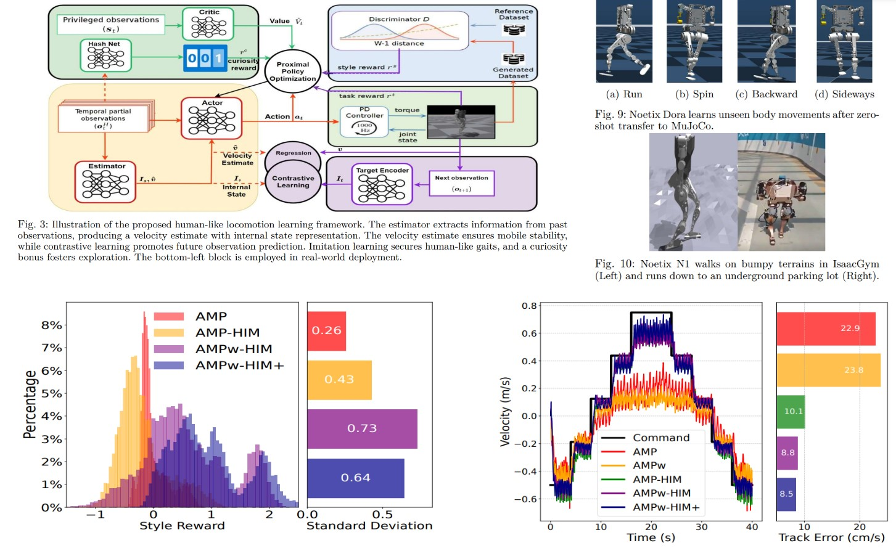
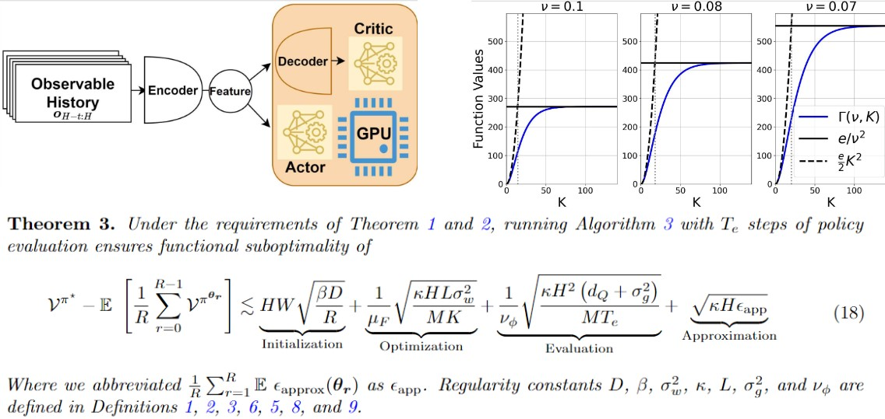
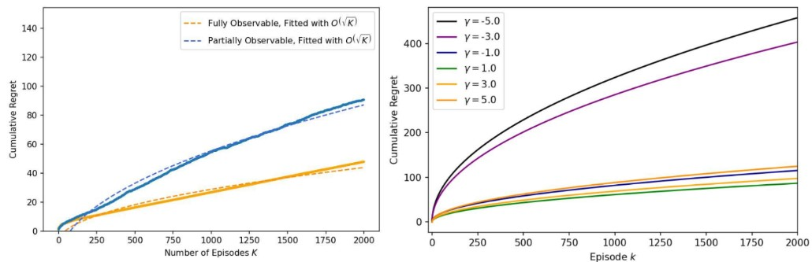

## Short Research Statement

<!-- I have experience using _deep reinforcement and imitation learning for robot learning_ tasks, such as teaching robots to develop flexible and human-like movement or manipulation skills with strong generalization abilities. 
Additionally, I have conducted independent research in _theoretical reinforcement learning_,  focusing on the design and analysis of efficient algorithms for large-scale, partially observable systems, which are common in robotics and finance. 
My theoretical research is informed by practical RL projects, and I use insights from my theoretical work to explain or enhance empirical studies.  -->

## Humanoid Locomotion Learning

Trained 18 DoF humanoid robot to walk, spin, sidestep and run like a human, while closely following your command. 
Methods: contrastive learning, simulated supervision and WGAN-div imitation learning. 

<!-- Internship at embodied AI startup [Noetix Robotics](https://noetixrobotics.com/). May 2024 - Sep 2024 -->

<!-- We successfully trained the company's first-generation humanoid robot to navigate uneven terrains, achieving zero-shot transfer from IsaacGym to MuJoCo, Gazebo, and the real world. Additionally, we integrated the AMP algorithm with contrastive learning and the DreamWaq RL module to train another 18 DoF humanoid robot for multitasking capabilities (running, spinning, sidestepping) and to generalize to unseen human-like motions under varied commands. We have submitted a paper to ICRA 2025 detailing these research advancements. I am a co-first author and was responsible for 90% of the simulation experiments, as well as contributing to most of the writing.  -->

[Paper accepted at ICRA 2025](https://tonghe-zhang.github.io/files/ICRA2025_Think_on_Your_Feet.pdf)

## Distributed Partially-observable Reinforcement Learning

Established a theoretical model to explain the why deep reinforcement learning with parallel computation accelerates training of partially-observable Markov Decision Process. 
<!-- Duration: July 2024 - Oct 2024.    Advisor: [Yuejie Chi](https://users.ece.cmu.edu/~yuejiec/), Department of Electrical and Computer Engineering, Carnegie Mellon University -->

<!-- Inspired by empirical deep reinforcement learning algorithms in robot locomotion research, we propose a novel framework for analyzing massively parallel policy optimization for continuous-state Partially Observable Markov Decision Processes. We design an actor-critic algorithm with noisy gradients, periodic synchronization, and minimal computation cost, and rigorously establish global convergence rates for a wide range of softmax policies under linear function approximation, achieving linear speedup in sample complexity along with sublinear communication complexity.  This work is in preparation for International Conference on Artificial Intelligence and Statistics (AISTATS 2025).  -->

[Paper accepted at AISTATS 2025](https://tonghe-zhang.github.io/files/AISTATS2025_DistPOMDP.pdf)

## Risk-sensitive Reinforcement Learning
<!-- Advisor: [Longbo Huang](https://people.iiis.tsinghua.edu.cn/~huang/), Institute for Interdisciplinary Information Sciences, Tsinghua University. July 2023 - Feb 2024 -->
<!-- 
We present a novel formulation of risk-sensitive reinforcement learning (RL) in partially observable environments with hindsight observations, and developed a model-based, Upper Confidence Bound (UCB)-style algorithm with a risk-sensitive bonus to leverage imperfect state information. 
We conduct a sample complexity analysis with a change-of-measure technique, and demonstrate that our algorithm outperforms or matches existing bounds in simpler settings. Findings are validated through numerical experiments, and is accepted by ICML 2024. -->

Designed an algorithm to learn the optimal policy in risk-sensitive decision making using incomplete information. 

[Paper accepted at ICML 2024](https://proceedings.mlr.press/v235/zhang24g.html)

[Github Repository](https://github.com/Tonghe-Zhang/Beta-vector-value-iteration)

**Citation in APA format**

> **Zhang, T**., Chen, Y. &amp; Huang, L.. (2024). Provably Efficient Partially Observable Risk-sensitive Reinforcement Learning with Hindsight Observation. <i>Proceedings of the 41st International Conference on Machine Learning</i>, in <i>Proceedings of Machine Learning Research</i> 235:58680-58716 Available from https://proceedings.mlr.press/v235/zhang24g.html.

